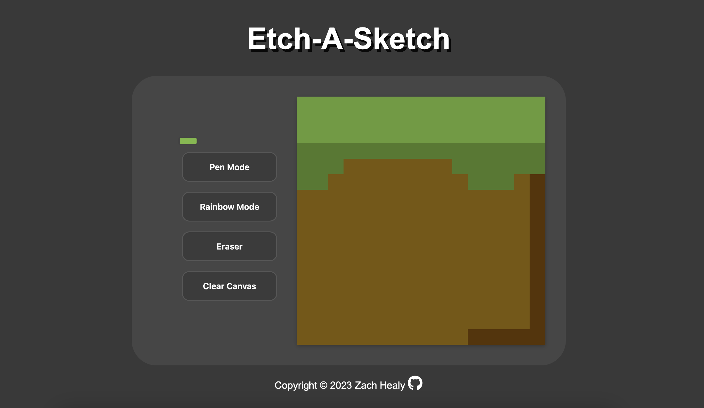

# Etch-A-Sketch
My first JavaScript project! I created a small website that allows a user to draw pixel art on the provided canvas, with options to change the pen color, use an eraser, use a rainbow brush mode, and even just clear the canvas as a whole.

---
### Future Plans
- Add in the ability to change the canvas size
- Add an export function
- Add an undo button

## Screenshots

